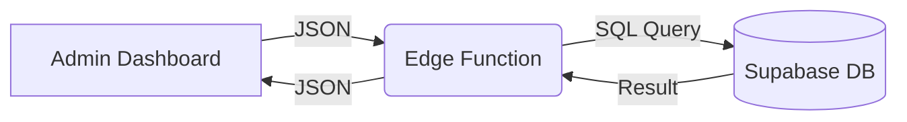

# Booking System Architecture - Complete Flow Documentation

> **Purpose**: This document explains the complete booking flow from start to finish. Use this as context when creating new functions or explaining the system to AI.

## Race Condition & Availability Check Policy (Strict)

**Core Rule**: NEVER trust a slot is open just because it was displayed in the UI or a previous message.

### 1. The "Double-Check" Rule
Every critical action (Booking, Promo Redemption, Payment) MUST perform a real-time availability check **immediately before** execution.

| Action | Check Required | Implementation |
|--------|----------------|----------------|
| **Admin Booking** | ✅ Yes | `create-booking` performs DB conflict check. |
| **Promo Code V1** | ✅ Yes | `validate-promo-code` checks `bookings` table before returning valid. |
| **Promo Code V2** | ✅ Yes | (Future) Must check availability before deducting coupon. |
| **LINE Bot Search** | ✅ Yes | `handleCheckTimeSearchAll` checks `checkAvailability` before showing confirmation. |
| **LINE Bot Book** | ✅ Yes | If user clicks "Book" from old message, system re-checks. |

### 2. User Feedback Standard
- **If Slot Taken**: Return a clear error message: "สนามไม่ว่างแล้ว (มีผู้จองตัดหน้าเมื่อสักครู่)"
- **Bot Behavior**: If a user clicks a button from an old carousel (e.g., from 1 hour ago), the system must validate the slot again. If taken, reply: "ขออภัยครับ ช่วงเวลานี้ถูกจองไปแล้ว 😅"

### 3. Database Integrity
- Use database constraints where possible.
- Use atomic transactions when handling coupon deductions + booking creation.

---

## System Overview

**Tech Stack**:
- **Frontend**: React + TypeScript (Vite)
- **Backend**: Supabase Edge Functions (Deno)
- **Database**: Supabase PostgreSQL (Local-First)

**Architecture Shift (2026-01)**: The system has migrated from a hybrid wrapper around Matchday to a **Standalone Booking System**.
- **Single Source of Truth**: Local Supabase Database (`bookings` table).
- **Matchday**: Deprecated/Removed. We no longer pull data from or sync to Matchday.

---

## Data Model (Supabase)

### 1. `bookings` Table (Core)
The primary table for all booking data.
```sql
CREATE TABLE bookings (
    booking_id BIGSERIAL PRIMARY KEY,
    field_no INTEGER NOT NULL,      -- Field ID (1-6)
    date DATE NOT NULL,             -- Booking Date
    time_from TIME NOT NULL,        -- Start Time
    time_to TIME NOT NULL,          -- End Time
    price_total_thb INTEGER,        -- Final Price
    customer_id TEXT,               -- Link to Profile (or null)
    display_name TEXT,              -- Customer Name
    phone_number TEXT,              -- Contact
    status TEXT DEFAULT 'confirmed',-- confirmed, cancelled
    is_promo BOOLEAN DEFAULT FALSE,
    admin_note TEXT,
    source TEXT DEFAULT 'admin',    -- admin, line
    paid_at TIMESTAMPTZ,
    user_id TEXT,                   -- LINE User ID (Optional/Nullable for Admin bookings)
    timeout_at TIMESTAMPTZ,         -- [NEW] Cancellation deadline for QR bookings
    payment_method TEXT,            -- [NEW] qr, field
    payment_status TEXT,            -- [NEW] pending, paid
    payment_slip_url TEXT,          -- [NEW] URL to uploaded slip in Supabase Storage
    created_at TIMESTAMPTZ DEFAULT NOW()
);
```

### 2. `profiles` Table
Stores customer information and segmentation tags.
```sql
CREATE TABLE profiles (
    user_id TEXT PRIMARY KEY,       -- LINE User ID
    team_name TEXT,
    phone_number TEXT,
    tags TEXT[] DEFAULT '{}'        -- [NEW] Replacing role system
);
```

### 3. `promo_codes` Table
Stores discount codes and usage history.
```sql
CREATE TABLE promo_codes (
    code VARCHAR(6) UNIQUE NOT NULL,
    status VARCHAR(20) DEFAULT 'active',
    -- ... validity details
);
```

---

## LINE Bot Search Workflow

### Overview
The LINE Bot provides a simplified search interface focusing on **Time** and **Duration** rather than specific fields.

### Flow Steps
### Flow Steps
1.  **User Interaction**: User taps "จองสนาม" or "ค้นหาเวลา".
2.  **Profile Check (Onboarding)**:
    - System checks `profiles` table for `user_id`.
    - **If Missing**: Bot asks for **Team Name** and **Phone Number**.
    - **If Found**: Proceeds to next step.
3.  **Search All Fields**:
    - User selects **Date** (Today/Tomorrow/Custom).
    - User selects **Duration** (1hr, 1.5hr, 2hr).
    - System searches all fields and displays available slots in a Carousel.
4.  **Booking/Promo**:
    - User selects a time slot.
    - System generates a **Promo Code** for that slot.

---

## Service Logic: Search Strategy

### Strategy: 30-Minute Grid (Current Standard)
The system uses a **30-Minute Grid** strategy to find available slots.

- **Step Interval**: 30 minutes (08:00, 08:30, 09:00...)
- **Why**:
    - Catches "half-hour" slots (e.g., 14:30) that hourly searches miss.
    - Easier to implement and more predictable than "Gap Filling".
    - Maximizes revenue by finding 1.5h holes in the schedule.

### Algorithm
```typescript
// searchService.ts
const STEP = 30; // 30-minute intervals
for (let t = Open; t + Duration <= Close; t += STEP) {
    if (!isConflict(t, Duration)) slots.push(t);
}
```

---

## Complete Booking Flow (Step-by-Step)

### 1. User Initiates Booking
**Location**: Frontend UI (Admin Dashboard)
**Action**: User selects Court, Time, and enters details.
**API Call**: `POST /functions/v1/create-booking`

### 2. Edge Function Processing
**File**: `supabase/functions/create-booking/index.ts`

**Steps**:
1.  **Validate Input**:
    - **Admin Mode**: `userId` is optional (Walk-in customers). **Payment method is restricted to 'Cash' (field)**.
    - **Line Mode**: `userId` is required for notifications. Supports 'QR' and 'Cash'.
    - `source` defaults to `'line'` if unspecified, but Dashboard sends `'admin'`.
2.  **Calculate Price**:
    - Uses local `PRICING` config.
    - Applies Pre/Post 18:00 logic.
    - Rounds UP to nearest 100.
3.  **Conflict Check**: (Implicitly handled but should be explicit)
    - Though `create-booking` currently trusts the admin, best practice is to check overlaps.
4.  **Insert into Database**:
    - Direct `INSERT` into `bookings` table.
    - Sets `status: 'confirmed'` and **`payment_status: 'pending'`** (for Cash).
    - `user_id`: Can be `NULL` for admin walk-ins.
    - `source`: Recorded as `'admin'` (if from dashboard) or `'line'`.
    - Generates numeric `booking_id` (timestamp-based) for compatibility.

### 3. Return Response for UI Update
Returns the created booking object immediately. No external API delays.

---

## Promo Code Booking Flow

### 1. Promo Code Generation (LINE Bot)
- User selects time slot -> System generates code in `promo_codes`.
- Calculates `final_price` based on discount rules.

### 2. Admin Uses Promo Code
**Location**: Admin Dashboard -> "ใช้โค้ด/Redeem Code"
**API Call**: `POST /functions/v1/validate-promo-code`
- **Validation**: Checks status (active), expiry, and **Real-Time Slot Availability** (Double-Check).
- **Error Handling**: If taken, returns "สนามไม่ว่างแล้ว" to prevent conflicts.

### 3. Create Booking with Discount
**File**: `supabase/functions/use-promo-code-and-book/index.ts`

**Steps**:
1.  **Re-Validate**: Checks code status AND slot availability again (Triple-Check) to ensure no race condition occurred during the modal review.
2.  **Create Booking (Local Insert)**:
    - Inserts into `bookings` with `is_promo: true`, `source: 'line'`.
    - Sets `price_total_thb` to the discounted `final_price`.
    - Adds `admin_note` with promo details (e.g., "Promo: XXXXXX | Discount: 50").
3.  **Update Promo Status**:
    - Marks code as `used` in `promo_codes`.
    - Links `booking_id`.
4.  **Send Notification**:
    - Sends LINE Push Message to user (if `user_id` exists).

### 4. Automatic Notification
System sends a standardized confirmation message via LINE:
- "✅ การจองสำเร็จ"
- Shows Field, Date, Time, Net Price.
- Includes cancellation contact info.

---

## Key Files Reference

### Backend Functions
| File | Purpose |
|------|---------|
| `create-booking/index.ts` | **Core**: Admin manual booking creation |
| `use-promo-code-and-book/index.ts` | **Core**: Promo code redemption & booking |
| `get-bookings/index.ts` | **Core**: Fetch daily schedule (Local DB) |
| `bookingService.ts` / `searchService.ts` | Shared logic for slot availability (Bot) |
| `validate-promo-code/index.ts` | Check code validity & slot status |

---

## Critical Concepts for AI Context

### 1. Price Calculation Logic
**Rule**: Split booking into pre-18:00 (Price A) and post-18:00 (Price B) segments.
**Rounding**: Round UP total price to nearest 100 THB.

### 2. Timezone Handling
- System operates in **Asia/Bangkok (UTC+7)**.
- All database queries for `date` should ensure correct timezone comparison.
- Time strings are usually passed as `HH:MM`.

### 3. Date & Time Formatting Standards
To ensure UI consistency, all date and time displays must use the centralized utility `src/utils/date.ts`.

**Standard Formats**:
- **Date**: "จ. 23 ก.พ. 2026" (Short weekday, Day, Short month, AD Year)
- **Time**: "HH:MM" (24-hour format)
- **DateTime**: "จ. 23 ก.พ. 2026 18:00"

**Utility Functions**:
- `formatDate(dateInput)`: Formats a date string, Date object, or null/undefined.
- `formatTime(timeInput)`: Formats time (handles ISO strings, time-only strings, and Date objects).
- `formatDateTime(dateInput)`: Combines date and time formatting.

> [!IMPORTANT]
> Avoid using `.toLocaleDateString()` or `.toLocaleTimeString()` directly in components. Always import from `src/utils/date.ts` to maintain system-wide consistency and correct year (AD) handling.

---

## Version Control & Rollback

### Question: "Can I rollback if AI makes changes?"

**Answer**: Yes, using Git.

#### Step 1: Check Current Status
```bash
git status
```

#### Step 2: See What Changed
```bash
git diff
```

#### Step 3: Rollback Specific File
```bash
git checkout -- supabase/functions/create-booking/index.ts
```

#### Step 4: Rollback Everything
```bash
git reset --hard HEAD
```

---

## 6. Local Data Flow (Standalone)

**Purpose**: Direct interaction with the local Supabase database.

**Workflow**:

#### A. Reading Data (`get-bookings`)
1.  Frontend calls `get-bookings`.
2.  Edge function query `bookings` table directly.
3.  Filters by `date` and `status != 'cancelled'`.
4.  Returns array to frontend.

#### B. Writing Data (`create-booking` / `update-booking`)
1.  Frontend calls create/update endpoint.
2.  Edge function performs validation (conflicts, price).
3.  **Direct Insert/Update** to `bookings` table.
4.  No external API calls are made.

**Data Flow Diagram**:

    
    E[Admin Dashboard] -- View Schedule --> F(Edge Function: get-bookings)
    F -- 1. Fetch --> C
    F -- 2. Fetch Notes --> D
    F -- 3. Merge & Return --> E
```

---

## Admin Booking Management (Drag & Drop)

### Overview
The Admin Dashboard provides an interactive interface for managing bookings through drag-and-drop actions. This allows admins to:
1.  **Move Bookings**: Change time or court by dragging.
2.  **Resize Bookings**: Extend or shorten duration by dragging the edges.
3.  **Edit Details**: Click to edit price, name, phone number, and manually confirm payment.
4.  **Cash-Only Policy**: For admin-created bookings via `BookingModal`, the payment method is locked to **"Cash / Pay at Field"**. QR Payment flows are reserved for automated customer-facing LIFF app only.

### Drag & Drop Logic

**Component**: `BookingCard` within `DashboardPage`

1.  **Interaction**:
    - **Click**: Opens `BookingDetailModal`. (Threshold: < 5px movement)
    - **Drag**: Initiates move operation. (Threshold: > 5px movement)
    - **Resize**: Triggered by top/bottom handles.

2.  **Validation**:
    - **Collision Detection**: Prevents dragging onto existing bookings.
    - **Boundaries**: Constrained within opening hours (08:00 - 00:00).
    - **Snap to Grid**: 30-minute intervals.

3.  **Price Recalculation**:
    - Automatically recalculates price based on new time and duration (Pre/Post 18:00 rules).
    - Updates UI immediately (Ghost Element).

### Move Court Strategy (Backend)

**Edge Function**: `update-booking`

**Implementation**:
- **Direct Update**: Updates the `bookings` table directly via Supabase.
- **Fields Updated**: `field_no`, `time_from`, `time_to`, `price_total_thb`.
- **Preservation**: `booking_id`, `customer_id`, and `payment_status` are preserved unchanged.

### Data Synchronization & Status Logic

1. **Single Source of Truth**: The local `bookings` table. All updates are real-time.
2. **Payment Status Logic**:
    - **Unpaid (Blue/Amber)**: `paid_at` is `NULL`.
    - **Paid (Green)**: `paid_at` is NOT `NULL`.
    - **Note**: `payment_status` column is used for backend workflow, but the UI (Card/Modal) relies on `paid_at` to determine if the booking is fully settled.
3. **Price Editing**: Admins can manually override the calculated `price_total_thb` in the `BookingDetailModal`. The system will automatically recalculate the **Balance** (Total - 200 Deposit if applicable).

---

## Promotion V2 Architecture (Collectible Wallet)

### 1. Data Model Extension
Two new tables support the advanced coupon system:

**`campaigns` Table**:
- Defines the promotion rules (Discount vs Item, Quantity, Limits).
- **Inventory Control**: uses `remaining_quantity` for atomic deduction.
- **Constraints**: `eligible_fields`, `days_of_week`, `allowed_time_range`.

**`user_coupons` Table**:
- The "Wallet" for users.
- Links `user_id` (LINE UID) to `campaign_id`.
- Links `user_id` (LINE UID) to `campaign_id`.
- Tracks `status` ('active', 'used', 'expired').

### 9. Promotion V2 Architecture (Collectible Wallet)

> **Current Status**: Phase 1 (Core) Complete. Redemption & Micro-conditions Pending.

**A. Collecting a Coupon (`collect-coupon`)**
1.  **Validate**: Campaign Active? User Quota full?
2.  **Inventory Check (Atomic)**:
    ```sql
    UPDATE campaigns SET remaining_quantity = remaining_quantity - 1 
    WHERE id = ? AND remaining_quantity > 0
    ```
3.  **Grant**: Insert into `user_coupons`.

**B. Using a Coupon (`book-with-coupon`) [PENDING]**
*Logic currently not implemented in `create-booking`.*
1.  **Validate**: Coupon Active? Conditions Met (Field/Time)?
2.  **Lock Slot**: Check Booking Table for overlaps.
3.  **Execute**:
    - Create Booking (`is_promo: true`).
    - Mark Coupon as `USED`.

## 8. Anti-Gaming Policy & Fair Logic (2026-01)

### Overview
To prevent exploiting discounts (e.g., booking 2 hours with a coupon, then reducing to 30 mins), the system enforces an **Anti-Gaming Check** during every booking update.

### Core Logic (Update Booking)
**Location**: `supabase/functions/update-booking/index.ts`

When a booking with a **USED** coupon is modified:
1.  **Strict Rule (V2)**: If `New Duration < Old Duration` (Shrink), the coupon is **RELEASED** back to the wallet (`ACTIVE` status) and the booking is recalculated at full price. (Note: Originally planned as 'Burned/Destroyed', currently implemented as 'Return to Wallet' to allow re-booking correctly).
2.  **Fair Policy (Flexibility)**:
    - **Price Decrease Allowed**: If a user moves to a cheaper court (e.g., 1800 -> 1100) but keeps the **Same Duration**, the discount is **PRESERVED**. (Reason: Genuine court change, not gaming).
    - **Duration Check**: Compares `New Duration` vs `Old Duration`.
+
+---
+
+## 10. New Seamless Booking UI (Promotion V2 Interface)
+
+### Overview
+A modern, mobile-first booking interface designed for speed, clarity, and automatic value maximization. Available via `?mode=v2` or `?mode=v3` (Vertical).
+
+### Key Components
+1.  **Date Selection (Bottom Sheet)**:
+    - **Trigger**: A sleek "Date Pill" in the header.

---

## 10. New Seamless Booking UI (Promotion V2 Interface)

### Overview
A modern, mobile-first booking interface designed for speed, clarity, and automatic value maximization. Available via `?mode=v2` or `?mode=v3` (Vertical).

### Key Components
1.  **Date Selection (Bottom Sheet)**:
    - **Trigger**: A sleek "Date Pill" in the header.
    - **Modal**: A native-feeling slide-up bottom sheet with a 7-column calendar grid.
    - **Range**: Supports browsing any month via Prev/Next navigation.
2.  **Booking Grid**:
    - **V2**: Horizontal scrollable grid for a multi-court overview.
    - **V3**: Vertical layout optimized for single-hand mobile use.
3.- [x] **Auto-Apply Coupon Logic**:
    - Fetches the user's active coupons on mount.
    - Automatically selects the coupon that provides the **highest THB discount** for the current selection.
- [x] **Logic Unification (`useBookingLogic`)**:
    - **Architecture**: Core booking logic (state, fetching, calculations, handlers) is extracted into a shared custom hook `src/hooks/useBookingLogic.ts`.
    - **Parity**: Both `BookingV2Page` (Horizontal) and `BookingV3Page` (Vertical) share 100% of the same processing logic.
    - **Maintainability**: Changes to coupon handling, price calculation, or success redirection only need to be made in one place.
- [x] **Payment Filtering & UI Polish**:
    - **Restriction**: Coupons with `payment` conditions (e.g., QR Only) automatically filter out invalid methods in the `BookingConfirmationModal`.
    - **Centering**: If only one payment method is available, the button is automatically centered and sized for visual balance.

### Robust User Retrieval (LIFF)
To solve the "Missing required fields" issue, the system now uses a two-tier strategy for getting the `userId`:
1.  **LIFF SDK**: Direct call to `liff.getProfile()` (Most reliable).
2.  **URL Fallback**: If LIFF is not initialized or in a browser, fallback to `?userId=` parameter.
 Implementation: `src/lib/liff.ts` -> `getLiffUser()`.

---

## 11. QR Deposit & Payment Flow (2026-02)

### Overview
To secure bookings made via LINE, the system implements a **200 THB Deposit Flow** via PromptPay QR.

### QR Deposit Workflow
1.  **Booking Creation**: User selects 'QR' in LIFF. `create-booking` is called with `status: 'pending_payment'`.
2.  **Payment Request**: LINE Bot sends a Flex Message with a **PromptPay QR Code (fixed 200 THB)**.
3.  **Timeout**: The booking has a **10-minute timeout**. If not paid, `cron-cancel-unpaid` deletes/cancels it.
4.  **Slip Verification**:
    - User sends a slip image in the LINE chat.
    - Webhook (`handleImage`) uploads it to Supabase Storage (`payment-slips` bucket).
    - System verifies the slip (Mock) and updates booking to `status: 'confirmed'`, `payment_status: 'paid'`.
5.  **Balance Collection**: The remaining balance is marked as **Outstanding** and must be collected at the field.

### Admin Dashboard Status Colors (4-State Filter)
The booking cards on the dashboard use a 4-color system to help staff manage payments:

| Color | Status | Meaning |
|-------|--------|---------|
| **Pink (Rose)** | `pending_payment` | **Critical**: Waiting for 200 THB deposit (10m limit). |
| **Amber (Orange)** | QR + Paid Deposit | **Collect Balance**: 200 THB paid, need to collect remaining. |
| **Blue (Cyan)** | Cash/Field | **Collect Full**: No deposit, need to collect full amount. |
| **Green (Emerald)** | Fully Paid | **Done**: Balance is zero. |

### Financial Summary
The `BookingDetailModal` provides a breakdown:
- **Total Price**: Calculated based on duration/time.
- **Paid Deposit**: Fixed at 200 THB (if applicable).
- **Outstanding Balance**: The final amount to be collected at the field.

---

## Member Management & Profile Linking

### 1. Manual Profile Creation (Admin)
Admins can manually add customers via the **Customer Management** page (`CustomerPage.tsx`).
- **ID Generation**: Codes start with `manual_` + timestamp (e.g., `manual_1738639200000`).
- **Purpose**: Tracks walk-ins, phone bookings, or problematic users who can't register via the bot.

### 2. Robust Input Parsing (LINE Bot)
The LINE Bot onboarding flow (`profileService.ts`) uses a flexible algorithm to identify user input:
- **Phone Number Detection**: Searches for 9-10 digits anywhere in the message. Handles dashes, spaces, and formatting characters automatically.
- **Team Name Extraction**: Everything else in the message is treated as the Team Name.
- **Format Examples**: 
  - `หมูเด้ง เอฟซี 0812345678` (Success)
  - `081-111-2222 ทีมปลาท่องโก๋` (Success)
  - `"ABC Team" 0899998888` (Success)

### 3. Automatic Profile Linking (Adoption)
The `upsertProfile` function contains "Adoption Logic" to link manual entries to real LINE accounts:
1. When a user registers via LINE, the system looks for an existing profile with the **same phone number** where `user_id` starts with `manual_`.
2. If a match is found, the `manual_` ID is **updated/renamed** to the user's real LINE UID.
3. This preserves history and configuration from the manual record without creating duplicates.

### 4. Seamless Auto-Registration (2026-02)
To streamline the booking process and ensure accurate customer tracking, the system implements a seamless auto-registration flow during a user's first booking:
1. **Frontend Logic (`BookingConfirmationModal.tsx`)**:
   - The UI checks if the user's profile (`initialProfile`) is available when the modal opens.
   - **Returning Users**: If a profile exists, the "Team Name" and "Phone Number" fields are displayed as read-only text, removing friction.
   - **New Users**: If no profile exists, input fields are shown requesting their details.
2. **Backend Logic (`create-booking` Edge Function)**:
   - After successfully inserting a new booking into the `bookings` table, the backend performs a check against the `profiles` table.
   - If the `userId` does not exist in the `profiles` table, a new profile is automatically created using the inserted `customerName` and `phoneNumber`.
   - This background process is wrapped in a fail-safe `try/catch` block so that any profile creation issues do not block the core booking confirmation.

---


## 12. Regular Booking (VIP Implementation)

### Overview
A special booking mode for VIP customers (e.g., long-term contracts) that allows them to book multiple slots at once using a **Secret Code** flow in LINE.

### Flow Description
1.  **Entry Point**: User types a secret keyword (e.g., "จองประจำ") in LINE.
2. **Validation**:
    - System checks `profile.tags` for 'vip'.
    - If valid, starts the flow. If not, replies with standard message.
3.  **Selection**:
    - User selects **Day** (e.g., Every Thursday).
    - User selects **Time** (e.g., 18:00 - 20:00).
    - User selects **Field** (Specific ID or ANY).
4.  **Summary & Discount**:
    - System calculates total price for the selected range (e.g., next 4 weeks).
    - User inputs a **Manual Promo Code** (e.g., "TMG100").
    - System verifies code limit (`usage_limit`) and applies discount.
5.  **Confirmation**:
    - User confirms booking.
    - System creates multiple booking records in `bookings` table.
    - `source` is set to `line`.
    - Promo code usage is incremented atomically.

### Key Data Structures

#### `manual_promo_codes` Table
Used for VIP-specific discounts.
```sql
CREATE TABLE manual_promo_codes (
    id SERIAL PRIMARY KEY,
    code TEXT UNIQUE NOT NULL,
    discount_amount INTEGER DEFAULT 0,
    discount_type TEXT DEFAULT 'fixed', -- 'fixed' or 'percent'
    usage_limit INTEGER DEFAULT 0,      -- Max allowed uses
    usage_count INTEGER DEFAULT 0,      -- Current usage
    status TEXT DEFAULT 'active'
);
```

### Logic Implementation (`regular-booking` flow)
- **Dynamic Pricing**: Calculates price per slot using `calculatePrice`, ensuring accuracy for different fields (e.g., Field 3 vs Field 1).
- **Atomic Updates**: Uses strict read-modify-write pattern (with retries) for incrementing `usage_count`.
- **Silent Failure**: Invalid promo codes do not block the flow but show an error message, maintaining the "secret" feel.

---

### 14. Tag-Based Segmentation & Broadcasting (2026-02)

### Overview
The system has fully migrated from a hardcoded `role` column to a flexible `tags` array. This allows for arbitrary user groups (e.g., `vip`, `blacklisted`, `staff`, `tournament-group-a`).

### 14.1 Broadcast Workflow
1.  **Admin UI**: Admin selects a campaign and clicks "Broadcast".
2.  **Targeting**: Admin can choose "All Customers" or select specific tags to target.
3.  **Function (`broadcast-campaign`)**:
    - Fetches the campaign Flex Message.
    - Filters `profiles` using the `tags` array (via SQL `contains` or `@>`).
    - Sends multicast messages to batches of up to 500 users at a time.

### 14.2 VIP Logic
### 14.3 Tag Management UI (Admin)
Admins can manage tags directly from the **Customer Detail Page**:
1.  **View Tags**: Displays current tags as colored chips (Yellow for `vip`, Red for `inactive`, Gray for others).
2.  **Add Tag**: Users can type a new tag name and press Enter to add it.
3.  **Remove Tag**: Clicking the "X" on a tag chip removes it immediately.
4.  **Sync**: Changes are synced to the `profiles` table in real-time via Supabase.

---

## 16. VIP Booking System (Phase 3)
### Overview
The VIP Booking System allows privileged users ("Regulars") to book multiple slots in advance, a feature not available to standard users.

### key Components:
1.  **Tag-Based Access**:
    - Users must have the `vip` tag in their profile to access the "Regular Booking" menu in the LINE Bot.
    - If a non-VIP user tries to access it, they receive a restricted access message.

2.  **Secret Code (Manual Promo Codes)**:
    - VIPs use special codes (managed in `PromoCodePage` -> `VIPCodeTab`) to get discounts on bulk bookings.
    - These codes are stored in the `manual_promo_codes` table and are separate from the V1/V2 coupon system.

3.  **Booking Logic**:
    - The bot allows selecting a day of the week, time range, and duration for multiple weeks.
    - It generates multiple booking records (one for each week) in a single transaction.

---

## 17. Admin Booking Search & Bulk Operations (2026-02)

### Overview
A powerful interface for Admins to find specific bookings and perform mass updates. Located at `/admin/search`.

### 17.1 Search & Filter Strategy
The page uses a **Supabase-First** approach for high performance:
1.  **Text Search**: Uses PostgreSQL `ilike` to search against `display_name`, `phone_number`, and `admin_note` simultaneously.
2.  **Multi-Filters**:
    - **Status**: Confirmed, Cancelled, Pending.
    - **Payment**: Paid, Unpaid (QR/Cash).
    - **Promo**: Show only discounted bookings.
    - **Date Range**: Support for custom ranges (Start -> End).

### 17.2 Bulk Actions
To streamline operations, Admins can toggle "Select Mode" to perform actions on multiple items:
1.  **Bulk Cancel**: 
    - Change status to `cancelled`.
    - **Coupon Refund Logic**: If a booking used a coupon, the admin is prompted to "Return Coupon" (restore quota) or "Burn Coupon" (mark as used).

### 17.3 UX Optimizations
- **Debounced Search**: Text input waits 500ms before querying to reduce DB load.
- **Thai Date Support**: All date pickers and display columns use `th-TH` locale and Buddhist Year (BE) formatting.


---

## 13. Coupon V2 Implementation Details & Logic (2026-02)

### 13.1 V1 vs V2 Data Structure
*   **V1 (Legacy Promo Codes)**: Stored in `promo_codes` table. Discounts are fixed values.
*   **V2 (Coupons)**: Stored in `user_coupons` table. Linked to `campaigns` table. **NOT** synced to `promo_codes`.

### 13.2 Dashboard Compatibility & Flexible Anti-Gaming
The system enforces a **Flexible but Safe** anti-gaming policy:

1.  **Discount Visibility**: 
    - The `get-bookings` function now joins `user_coupons` + `campaigns` to calculate the effective discount on the fly.
    - This creates a **Virtual Discount Field** in the API response, even though `promo_codes` table is empty.

2.  **Flexible Modification Rule (Upsell Friendly)**:
    - **Case A: Upsell (Increase Duration/Price)**: The system recalculates `(New Price + Added Time) - Original Discount`. **The discount is PRESERVED**, allowing customers to pay only the difference.
    - **Case B: Downsell (Decrease Duration/Price)**: The frontend "Anti-Gaming Check" detects the shrink. It effectively **REMOVES** the discount from the calculation context to prevent exploiting coupons for cheaper slots.

3.  **Benefit**:
    - **Win-Win**: Honest customers can extend their playtime without losing their coupon benefit.
    - **Safe**: Bad actors cannot shrink a booking to pay less than the coupon intended.

### 13.3 Redemption Limit & Race Condition (Atomic Flow)
The system enforces strict redemption limits (e.g., "Only first 5 payers get the discount") using atomic operations and fallback mechanisms.

1.  **Atomic Counter**: The system uses a PostgreSQL RPC (`increment_campaign_redemption`) to increment the count only if it's below the limit in a single transaction.
2.  **Race Condition Handling**: If a user pays for a booking but the quota fills up *at the exact same second* (Race Condition):
    - **Logic**: Detected when the RPC returns `false`.
    - **Action**: The system automatically **Cancels** the booking and flags it for a **Refund**.
    - **Notification**: The user is immediately notified via LINE that the quota is full and a refund is being processed.
3.  **Verification**: This flow was successfully verified using the `simulate-payment.ts` script, confirming that the counter increments correctly and status updates reflect in the Admin UI.

---

## 14. Action Persistence & Attendance Status (2026-02)

### Overview
To reduce manual coordination, the LINE Bot allows users to self-confirm their attendance or request a cancellation. The system persists these actions to show a clear history to both the user and the admin.

### Attendance Workflow
1.  **User Trigger**: User selects "ดูตารางจอง" in LINE.
2.  **Display Logic**: 
    - The `buildBookingsCarousel` function checks the `attendance_status`.
    - **Buttons**: If a status is already set (`confirmed` or `cancel_requested`), the action buttons are hidden to prevent duplicate or conflicting requests.
    - **Badges**: A status badge with the exact **ICT+7 (Thailand)** timestamp is displayed prominently on the card.
3.  **Record Keeping**:
    - **Table**: `bookings`
    - **Fields**: `attendance_status` (confirmed, cancel_requested), `attendance_updated_at` (timestamptz).
4.  **Admin Integration**:
    - "Cancel Requested" status updates the `admin_note` to "ลูกค้ายกเลิกผ่าน Bot" for visibility on the dashboard.
    - These records persist until the admin manually deletes or modifies the booking.

### Localized Time Implementation
Since Supabase Edge Functions run in UTC, the system explicitly offsets the time by **+7 hours** in `formatActionTime` before generating the Flex Message UI to ensure compatibility with Thailand Time (ICT).

---

## 15. Frontend Architecture & Deployment Strategy (2026-02)

### 15.1 Multi-App Deployment (Vercel)
To provide a clean user experience without subdomain costs, the system uses a **Multi-App** strategy from a single codebase.

*   **Repository**: Single Git Repo (`linebotbooking`)
*   **Projects**: Two Vercel projects deploying the same repo but with different configurations.
    1.  **Admin App**: (`linebotbooking-chi.vercel.app`) -> Default Mode (Admin).
    2.  **Customer App**: (`app-booking-sand.vercel.app`) -> Booking Mode via `VITE_APP_MODE=booking`.

### 15.2 Smart Routing & Redirects
The `RootRedirect` component in `App.tsx` acts as the traffic controller:

1.  **Priority 1: Deep Links**: Checks for `?redirect=...` query param.
    *   `wallet` -> Wallet Page
    *   `booking-v2/v3` -> Booking Page
2.  **Priority 2: Secure Login Check**: Detects LIFF callback params (`code`, `liff.state`) and shows a loading screen instead of redirecting, preventing loops.
3.  **Priority 3: App Mode**: Checks `VITE_APP_MODE`.
    *   `booking` -> Defaults to `/booking-v2` (Customer App).
    *   `wallet` -> Defaults to `/wallet`.
4.  **Default**: Redirects to `/admin` (Legacy/Admin App).

### 15.3 Performance Optimizations
To ensure instantaneous page loads for customers:

1.  **Selective Lazy Loading**:
    *   **Admin Pages**: Lazy loaded (`React.lazy`) to keep the initial bundle small.
    *   **Customer Pages**: **Statically Imported** (Wallet, Booking) to ensure they are immediately available without a second network request.
2.  **Parallel Data Fetching**:
    *   `useBookingLogic` fetches **Fields**, **Bookings**, and **Coupons** simultaneously using `Promise.all`.
    *   Reduces initial data wait time by ~40-50%.

---

## 18. Stripe Direct Payment (PromptPay) Integration (2026-02)

### 18.1 Overview
The system uses Stripe to handle automated PromptPay QR payments. This replaces the manual slip upload process with a secure, real-time transaction verified via webhooks.

### 18.2 QR Deposit Workflow (Standard)
1. **Frontend**: The user reaches `BookingSuccessPage.tsx`. It calls the `create-payment-intent` edge function.
2. **Backend (`create-payment-intent`)**:
    - Calculates a **Fixed 200 THB Deposit** (or full price if lower).
    - Creates a Stripe PaymentIntent with `payment_method_types: ['promptpay']`.
    - Returns the `clientSecret` to the frontend.
3. **Frontend**: Stripe.js opens the PromptPay QR modal automatically.
4. **Stripe Webhook**:
    - Receives `payment_intent.succeeded`.
    - Updates local DB booking to `payment_status: 'deposit_paid'`.
    - Sends LINE Flex Message showing the deposit paid and the **Remaining Balance** to be collected at the field.
    - **Crucial Configuration**: The `stripe-webhook` Edge Function MUST have JWT verification disabled (`verify_jwt = false` in `supabase/config.toml`) because Stripe's payload does not include a Supabase Auth Bearer token. It relies solely on `stripe-signature` for security.

### 18.3 Technical Details (Edge Functions)

#### `create-payment-intent`
- **Purpose**: Bridge between our system and Stripe API.
- **Metadata**: Stores `booking_id`, `field_no`, `deposit_amount`, and `total_price` inside the Stripe object for reconciliation.
- **Concurrency**: Updates `bookings.stripe_payment_intent_id` immediately so we have a reference.

#### `stripe-webhook`
- **Verification**: Uses `crypto.subtle` natively in Deno to verify `stripe-signature` with `STRIPE_WEBHOOK_SECRET` for security.
- **Processing**:
    - Extracts `booking_id` from metadata.
    - Updates `payment_status` to `'deposit_paid'` and `status` to `'confirmed'`.
    - Sends confirmation via LINE Messaging API.
    - Triggers `process-referral-reward` asynchronously.

### 18.4 Admin UI Logic
- **Balance Calculation**: `BookingDetailModal` checks for `deposit_paid` (or `payment_method === 'QR'`) status.
- **Formula**: `Balance = (Grand Total + Discount) - 200`.
- **Manual Confirmation**: If an admin clicks "Confirm Payment" on a QR booking with a missing webhook, the system smartly limits the status to `deposit_paid` rather than `paid` to preserve the outstanding 600 THB balance.
- **BookingCard Colors**: 
    - Applies `deposit_paid` (Amber Color) securely by assessing if `isQR` (case-insensitive) matches and `payment_status` is `paid` or `deposit_paid` without a full `paid_at` timestamp.

---

## 19. Affiliate & Referral System (2026-02)

### 19.1 Overview
The system incentivizes user growth through a "Refer-a-Friend" program.
- **Referee (New User)**: Uses a referral code to get **50% Discount** on their first booking.
- **Referrer (Existing User)**: Receives a **100 THB Coupon** reward when their referee completes payment.

### 19.2 Data Schema (Supabase)

#### A. Core Tables
1.  **`affiliates`**: Stores referrer stats.
    -   `user_id`: Link to Profile.
    -   `referral_code`: Unique code (e.g., `REF-1234-ABCD`).
    -   `total_referrals`, `total_earnings`: Aggregate stats for Dashboard.
    -   `status`: `APPROVED`, `PENDING`, `REJECTED`.

2.  **`referrals`**: Tracks individual referral events.
    -   `referrer_id` (Who invited), `referee_id` (Who joined).
    -   `booking_id`: The first booking made by the referee.
    -   `status`: `PENDING_PAYMENT` -> `COMPLETED`.

3.  **`referral_programs`**: Configuration.
    -   Defines `discount_percent` (50%) and `reward_amount` (100).

#### B. Reward Storage
-   **`user_coupons`**: Rewards are issued as standard V2 Coupons.
-   **Campaign**: A special background campaign "🎁 รางวัลแนะนำเพื่อน" allows stacking multiple active coupons.

### 19.3 Processing Flow

#### Step 1: Validation & Booking (`create-booking`)
1.  User inputs Referral Code.
2.  System validates:
    -   Code exists & is `APPROVED`.
    -   **Referee Eligibility**: Checks `referrals` table. If `referee_id` exists, they are **NOT** a new user.
3.  **Outcome**:
    -   Booking created with `is_promo: true`.
    -   Data inserted into `referrals` with status `PENDING_PAYMENT`.

#### Step 2: Payment Trigger (`update-booking`)
1.  Admin marks booking as **Paid** (or Stripe Webhook triggers it).
2.  `update-booking` detects `payment_status` change (`pending` -> `paid`).
3.  **Async Trigger**: Calls `process-referral-reward` Edge Function.

#### Step 3: Reward Execution (`process_referral_reward_sql`)
*Located in Postgres (PL/pgSQL) for atomicity.*

1.  **Verification**: Checks if referral is still `PENDING_PAYMENT`.
2.  **Campaign Check**: Auto-creates/Finds the "Referral Reward" campaign.
3.  **Coupon Issuance**:
    -   Inserts into `user_coupons`.
    -   **Critical**: Unique index on `(user_id, campaign_id, status)` was **DROPPED** to allow multiple "Active" rewards for super-referrers.
4.  **Stat Update**: Recalculates `total_referrals` and `earnings` in `affiliates` table.
5.  **Status Update**: Marks referral as `COMPLETED`.

#### Step 4: Notification
-   The Edge Function sends a **LINE Flex Message** to the Referrer: "You received a new coupon from [Friend's Name]!"

### 19.4 Constraints & Business Logic

**A. One-Time Use Per Referee (New Customer Only)**
- **Rule**: A customer can only be referred **ONCE** in their lifetime.
- **Logic**: The system checks the `referrals` table for any record where `referee_id` matches the current user.
- **Error**: If found, it returns "คุณเคยใช้สิทธิ์แนะนำเพื่อนไปแล้ว/You have already used the referral privilege".
- **Objective**: To prevent "Referral Cycling" where existing users refer each other to get 50% discounts.

**B. Self-Referral Prevention**
- **Rule**: A user cannot use their own referral code.
- **Logic**: Checks if `referrer_id == referee_id`.

**C. Eligibility Check (Affiliate Registration)**
- **Rule**: To become an Affiliate, a user must have at least **1 Booking History**.
- **Logic**: Checks `bookings` count > 0. (Does NOT require a pre-existing profile; creates one on the fly if needed).

### 19.5 Testing & Reset
To re-test the flow for the same user pair:
```sql
-- 1. Reset Referee (Allow them to be "New" again)
DELETE FROM referrals WHERE referee_id = 'REFEREE_UID';

-- 2. Reset Referrer Stats (Optional)
UPDATE affiliates SET total_referrals = 0, total_earnings = 0 WHERE user_id = 'REFERRER_UID';
DELETE FROM user_coupons WHERE user_id = 'REFERRER_UID' AND campaign_id = '...';
```
