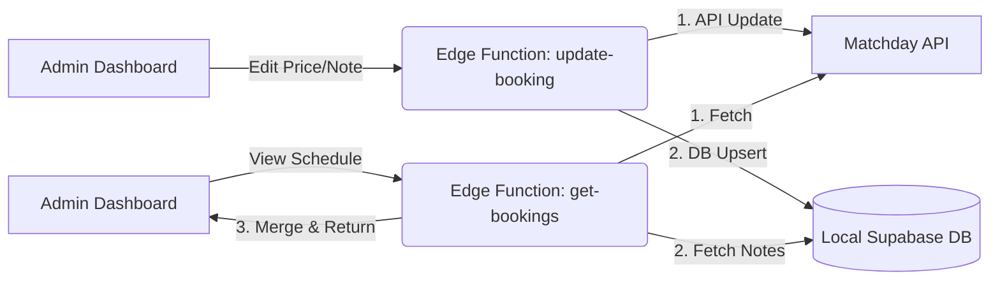

# Booking System Architecture - Complete Flow Documentation

> **Purpose**: This document explains the complete booking flow from start to finish. Use this as context when creating new functions or explaining the system to AI.

---

## System Overview

**Tech Stack**:
- **Frontend**: React + TypeScript (Vite)
- **Backend**: Supabase Edge Functions (Deno)
- **External API**: Matchday Arena API
- **Database**: Supabase PostgreSQL

**Key Concept**: The system acts as a **middleware** between the user interface and the Matchday API, handling price calculations and data transformations.

**Hybrid Data Model**:
- **Availability & Core Data**: Sourced from Matchday (Single Source of Truth for slots).
- **Metadata (Notes/Overrides)**: Sourced from Local Supabase DB.
- **Sync**: `update-booking` writes to both systems to ensure consistency.

---

## LINE Bot Search Workflow

### Overview
The LINE Bot provides a simplified search interface focusing on **Time** and **Duration** rather than specific fields.

### Flow Steps
1.  **Select Search Mode**: (Removed in v2) User taps "ค้นหาเวลา".
2.  **Select Date**: User chooses Today, Tomorrow, or picks a date.
3.  **Select Duration**: User chooses **1 Hr**, **1.5 Hr**, or **2 Hr**.
    - *Implementation Check*: This determines the slot size `durationMin`.
4.  **Display Results**: System searches all fields and displays available start times in a Carousel.

---

## Service Logic: Search Strategy

### Strategy: 30-Minute Grid (Current Standard)
The system uses a **30-Minute Grid** strategy to find available slots.

- **Step Interval**: 30 minutes (08:00, 08:30, 09:00...)
- **Why**:
    - Catches "half-hour" slots (e.g., 14:30) that hourly searches miss.
    - Easier to implement and more predictable than "Gap Filling".
    - Maximizes revenue by finding 1.5h holes in the schedule.

### Algorithm
```typescript
// searchService.ts
const STEP = 30; // 30-minute intervals
for (let t = Open; t + Duration <= Close; t += STEP) {
    if (!isConflict(t, Duration)) slots.push(t);
}
```

---

## Complete Booking Flow (Step-by-Step)

### 1. User Initiates Booking

**Location**: Frontend UI (React Component)

**File**: `src/pages/admin/DashboardPage.tsx` or similar booking form

**What Happens**:
1. User selects:
   - Court (Field 1-6)
   - Date
   - Start Time
   - End Time
   - Customer Name
   - Phone Number
   - Payment Slips (optional)

2. Frontend validates input

3. Frontend calls Supabase Edge Function

**API Call**:
```javascript
const response = await fetch(`${SUPABASE_URL}/functions/v1/create-booking`, {
    method: 'POST',
    headers: {
        'Content-Type': 'application/json',
        'Authorization': `Bearer ${SUPABASE_KEY}`
    },
    body: JSON.stringify({
        fieldId: 2425,           // Matchday Court ID
        date: "2026-01-27",
        startTime: "17:30",
        endTime: "18:30",
        customerName: "John Doe",
        phoneNumber: "0812345678",
        note: "Optional note"
    })
});
```

---

### 2. Edge Function Receives Request

**File**: [`supabase/functions/create-booking/index.ts`](file:///c:/Users/Tmango/Desktop/ระบบจองสนาม/supabase/functions/create-booking/index.ts)

**What Happens**:

#### Step 2.1: Validate Input
```typescript
const { fieldId, date, startTime, endTime, customerName, phoneNumber, note } = await req.json();

if (!fieldId || !date || !startTime || !endTime || !customerName || !phoneNumber) {
    return new Response(JSON.stringify({ error: 'Missing required fields' }), {
        status: 400
    });
}
```

#### Step 2.2: Map Field ID to Matchday Court ID
```typescript
const FIELD_MAP: Record<number, number> = {
    2424: 2424, // Field 1
    2425: 2425, // Field 2
    2428: 2428, // Field 3
    2426: 2426, // Field 4
    2427: 2427, // Field 5
    2429: 2429, // Field 6
};

const matchdayCourtId = FIELD_MAP[fieldId];
```

#### Step 2.3: Calculate Price
```typescript
function calculatePrice(fieldId: number, startTime: string, durationHours: number) {
    const prices = PRICING[fieldId];
    const [h, m] = startTime.split(':').map(Number);
    const startH = h + (m / 60);
    const endH = startH + durationHours;
    const cutOff = 18.0;

    let preHours = 0;
    let postHours = 0;

    if (endH <= cutOff) preHours = durationHours;
    else if (startH >= cutOff) postHours = durationHours;
    else {
        preHours = cutOff - startH;
        postHours = endH - cutOff;
    }

    let prePrice = preHours * prices.pre;
    let postPrice = postHours * prices.post;

    // Round UP to nearest 100
    if (prePrice > 0 && prePrice % 100 !== 0) {
        prePrice = Math.ceil(prePrice / 100) * 100;
    }
    if (postPrice > 0 && postPrice % 100 !== 0) {
        postPrice = Math.ceil(postPrice / 100) * 100;
    }

    return Math.round(prePrice + postPrice);
}
```

**Pricing Table**:
```typescript
const PRICING = {
    2424: { pre: 500, post: 700 },  // Field 1
    2425: { pre: 500, post: 700 },  // Field 2
    2428: { pre: 1000, post: 1200 }, // Field 3
    2426: { pre: 800, post: 1000 },  // Field 4
    2427: { pre: 800, post: 1000 },  // Field 5
    2429: { pre: 1000, post: 1200 }, // Field 6
};
```

---

### 3. Create Booking in Matchday

**What Happens**:

#### Step 3.1: Prepare Payload
```typescript
const timeStartStr = `${date} ${startTime}:00`;
const timeEndStr = `${date} ${endTime}:00`;

const body = {
    courts: [matchdayCourtId.toString()],
    time_start: timeStartStr,
    time_end: timeEndStr,
    settings: {
        name: customerName,
        phone_number: phoneNumber,
        note: note || ''
    },
    payment: 'cash',
    method: 'fast-create',
    payment_multi: false,
    fixed_price: null,  // IMPORTANT: Set to null to avoid price conflicts
    member_id: null,
    user_id: null
};
```

#### Step 3.2: Call Matchday API
```typescript
const res = await fetch(`${MD_BASE_URL}/arena/create-match`, {
    method: 'POST',
    headers: {
        'Content-Type': 'application/json',
        'Authorization': `Bearer ${MD_TOKEN}`,
        'Origin': 'https://arena.matchday.co.th'
    },
    body: JSON.stringify(body)
});

const data = await res.json();
const createdMatch = data.match || (data.matches && data.matches[0]);
```

---

### 4. Auto-Correct Price (Critical Step)

**Why This Is Needed**: Matchday's initial creation uses default pricing. We need to update it with our calculated price.

**What Happens**:

#### Step 4.1: Wait for Creation to Settle
```typescript
await new Promise(resolve => setTimeout(resolve, 5000)); // 5 second delay
```

#### Step 4.2: Update Match with Correct Price
```typescript
const updateRes = await updateMatch(createdMatch.id, {
    time_start: timeStartStr,      // Required for recalculation
    time_end: timeEndStr,          // Required for recalculation
    description: `${customerName} ${phoneNumber}`,
    change_price: price,           // Override price
    price: price                   // Base price (CRITICAL FIELD)
});
```

**API Endpoint**: `PUT https://arena.matchday-backend.com/arena/match/{matchId}`

**Why All These Fields?**:
- `time_start` / `time_end`: Triggers Matchday to recalculate
- `change_price`: Sets the override price
- `price`: Sets the base price (updates `total_price` field)
- `description`: Updates customer info

---

### 5. Return Response to Frontend

**What Happens**:

```typescript
return new Response(JSON.stringify({ 
    success: true, 
    data,           // Matchday response
    price,          // Calculated price
    autoCorrected,  // Whether price was updated
    updateResult    // Update API response
}), {
    status: 200,
    headers: { ...corsHeaders, 'Content-Type': 'application/json' }
});
```

---

## Promo Code Booking Flow

### Overview

The promo code system allows admins to use discount codes generated via LINE Bot to create bookings with reduced prices. The discounted price must be correctly synchronized across all systems:
- Admin Dashboard
- Matchday Booking Card
- Matchday Details Modal

### Complete Flow

#### 1. Promo Code Generation (LINE Bot)

**When**: User finds available slot via LINE Bot

**What Happens**:
1. User searches for available time slots
2. System calculates original price
3. System generates 6-digit promo code
4. Code stored in `promo_codes` table with:
   - Booking details (field, date, time)
   - Original price
   - Discount (10% or fixed amount)
   - Final price (after discount)
   - Expiry time (30 minutes)

**Database Table**: `promo_codes`
```sql
CREATE TABLE promo_codes (
  id BIGSERIAL PRIMARY KEY,
  code VARCHAR(6) UNIQUE NOT NULL,
  user_id TEXT NOT NULL,
  field_id INTEGER NOT NULL,
  booking_date DATE NOT NULL,
  time_from TIME NOT NULL,
  time_to TIME NOT NULL,
  duration_h NUMERIC NOT NULL,
  original_price NUMERIC NOT NULL,
  discount_type VARCHAR(10) NOT NULL,  -- 'percent' or 'fixed'
  discount_value NUMERIC NOT NULL,
  discount_amount NUMERIC NOT NULL,
  final_price NUMERIC NOT NULL,
  status VARCHAR(20) DEFAULT 'active',  -- 'active', 'used', 'expired'
  expires_at TIMESTAMPTZ NOT NULL,
  booking_id TEXT,
  created_at TIMESTAMPTZ DEFAULT NOW()
);
```

#### 2. Admin Uses Promo Code

**Location**: Admin Dashboard → "ใช้โค้ดโปรโมชั่น" button

**File**: [`src/components/ui/PromoCodeModal.tsx`](file:///c:/Users/Tmango/Desktop/ระบบจองสนาม/src/components/ui/PromoCodeModal.tsx)

**What Happens**:

**Step 2.1: Validate Code**
```typescript
const response = await fetch(`${SUPABASE_URL}/functions/v1/validate-promo-code`, {
    method: 'POST',
    body: JSON.stringify({ code: '123456' })
});

const { valid, code } = await response.json();
// Returns: { valid: true, code: { ...promo details } }
```

**Function**: [`validate-promo-code/index.ts`](file:///c:/Users/Tmango/Desktop/ระบบจองสนาม/supabase/functions/validate-promo-code/index.ts)

Checks:
- Code exists
- Status is 'active'
- Not expired

**Step 2.2: Display Booking Details**

Modal shows:
- Court name and type
- Date and time
- Original price: 700 THB
- Discount: 10% (-70 THB)
- **Final price: 630 THB** ← This is what should appear everywhere

**Step 2.3: Admin Confirms**

Admin enters:
- Customer name
- Phone number

Then clicks "ยืนยันและจองเลย"

#### 3. Create Booking with Discount

**Function**: [`use-promo-code-and-book/index.ts`](file:///c:/Users/Tmango/Desktop/ระบบจองสนาม/supabase/functions/use-promo-code-and-book/index.ts)

**Critical Implementation** (Proven Pattern):

```typescript
// Step 1: Create booking in Matchday
const bookingPayload = {
    courts: [matchdayCourtId.toString()],
    time_start: `${promo.booking_date} ${timeFrom}:00`,
    time_end: `${promo.booking_date} ${timeTo}:00`,
    settings: {
        name: customerName,
        phone_number: phoneNumber,
        note: `Promo: ${promoCode} | Price: ${promo.final_price}`
    },
    payment: 'cash',
    method: 'fast-create',
    payment_multi: false,
    fixed_price: null,  // ⚠️ CRITICAL: Must be null
    member_id: null,
    user_id: null
};

const response = await fetch(`${matchdayUrl}/arena/create-match`, {
    method: 'POST',
    headers: {
        'Authorization': `Bearer ${matchdayToken}`,
        'Content-Type': 'application/json'
    },
    body: JSON.stringify(bookingPayload)
});

const booking = await response.json();
const createdMatch = booking.match || booking.matches[0];

// Step 2: Wait for Matchday to settle
await new Promise(resolve => setTimeout(resolve, 5000));  // ⚠️ CRITICAL: 5 seconds

// Step 3: Update with discounted price
const updatePayload = {
    time_start: `${promo.booking_date} ${timeFrom}:00`,  // ⚠️ Required
    time_end: `${promo.booking_date} ${timeTo}:00`,      // ⚠️ Required
    description: `${customerName} ${phoneNumber}`,
    change_price: promo.final_price,  // Override price
    price: promo.final_price          // ⚠️ CRITICAL: Force base price update
};

await fetch(`${matchdayUrl}/arena/match/${createdMatch.id}`, {
    method: 'PUT',
    headers: {
        'Authorization': `Bearer ${matchdayToken}`,
        'Content-Type': 'application/json'
    },
    body: JSON.stringify(updatePayload)
});

// Step 4: Mark promo code as used
await supabase
    .from('promo_codes')
    .update({
        status: 'used',
        used_at: new Date().toISOString(),
        booking_id: createdMatch.id.toString()
    })
    .eq('id', promo.id);

// Step 5: Send LINE notification to user
const notificationResult = await sendBookingNotification(
    promo.user_id,
    promo,
    customerName,
    phoneNumber
);
```

#### 4. Automatic LINE Notification

**New Feature** (Added 2026-01-25):

After successfully creating the booking and marking the promo code as used, the system automatically sends a confirmation message to the user via LINE.

**Message Content**:
```
✅ การจองของคุณสำเร็จแล้ว!

📍 สนาม: สนาม 2 (5 คน)
📅 วันที่: 27 ม.ค. 2569
⏰ เวลา: 17:30 - 18:30 (1 ชม.)

💰 ราคาเต็ม: 700 บาท
🎟️ ส่วนลด: -70 บาท (10%)
✨ ราคาสุทธิ: 630 บาท

👤 ชื่อผู้จอง: [ชื่อลูกค้า]
📞 เบอร์โทร: [เบอร์โทรศัพท์]

ชำระเงินได้ที่สนาม
หากต้องการยกเลิก กรุณาติดต่อ 083-914-4000
```

**Key Features**:
- ✅ Sent via LINE Push Message API
- ✅ Thai localization (Buddhist calendar, Thai month names)
- ✅ Complete booking details (field, date, time, price, discount)
- ✅ Contact information for cancellation (083-914-4000)
- ✅ **Fail-safe**: If notification fails, booking still succeeds

**Implementation**:
- Uses `pushMessage()` from `lineClient.ts`
- Sends to `promo.user_id` (LINE User ID)
- Returns `{ success: boolean, error?: string }`
- Logged for debugging: `[Notification] Sent booking confirmation to user ...`

#### 5. Price Synchronization

1. **`fixed_price: null`** in creation:
   - Prevents Matchday from locking the price
   - Allows subsequent updates to take effect

2. **5-second delay**:
   - Matchday runs async price calculation
   - Without delay, update gets overwritten
   - Race condition prevention

3. **Complete update payload**:
   - `time_start`, `time_end`: Trigger recalculation
   - `change_price`: Sets override price
   - `price`: **CRITICAL** - Updates `total_price` in booking card
   - Without `price` field: Card shows 700, Details show 630 ("Split Brain")

#### 4. Price Synchronization

**Result After Correct Implementation**:

| Location | Price Displayed |
|----------|----------------|
| Admin Dashboard | 630 THB ✅ |
| Matchday Booking Card | 630 THB ✅ |
| Matchday Details Modal | 630 THB ✅ |

**Matchday API Response Fields**:
```json
{
  "match": {
    "id": 12345,
    "total_price": 630,      // Card view
    "match_price": 630,      // Line item
    "price": 630,            // Base price
    "change_price": 630      // Override
  },
  "bill": {
    "total": 630
  }
}
```

### Common Issues & Fixes

#### Issue 1: "Split Brain" Pricing
**Symptom**: Card shows 700, Details show 630
**Cause**: Missing `price` field in update payload
**Fix**: Add `price: promo.final_price` to update

#### Issue 2: Price Not Updating
**Symptom**: Always shows original price (700)
**Cause**: `fixed_price` set to original price in creation
**Fix**: Set `fixed_price: null` in creation payload

#### Issue 3: Intermittent Failures
**Symptom**: Sometimes works, sometimes doesn't
**Cause**: Race condition - update happens too fast
**Fix**: Increase delay to 5000ms (5 seconds)

#### Issue 4: Price Recalculation Wrong
**Symptom**: Price updates but to wrong amount
**Cause**: Missing `time_start`/`time_end` in update
**Fix**: Always include time fields in update payload

---

## Key Files Reference

### Backend Functions

| File | Purpose |
|------|---------|
| [`create-booking/index.ts`](file:///c:/Users/Tmango/Desktop/ระบบจองสนาม/supabase/functions/create-booking/index.ts) | Main booking creation logic |
| [`use-promo-code-and-book/index.ts`](file:///c:/Users/Tmango/Desktop/ระบบจองสนาม/supabase/functions/use-promo-code-and-book/index.ts) | Promo code booking with discount |
| [`validate-promo-code/index.ts`](file:///c:/Users/Tmango/Desktop/ระบบจองสนาม/supabase/functions/validate-promo-code/index.ts) | Validate promo code status |
| [`cancel-booking/index.ts`](file:///c:/Users/Tmango/Desktop/ระบบจองสนาม/supabase/functions/cancel-booking/index.ts) | Booking cancellation |
| [`get-bookings/index.ts`](file:///c:/Users/Tmango/Desktop/ระบบจองสนาม/supabase/functions/get-bookings/index.ts) | Fetch bookings for display |
| [`_shared/matchdayApi.ts`](file:///c:/Users/Tmango/Desktop/ระบบจองสนาม/supabase/functions/_shared/matchdayApi.ts) | Shared Matchday API utilities |
| [`_shared/promoService.ts`](file:///c:/Users/Tmango/Desktop/ระบบจองสนาม/supabase/functions/_shared/promoService.ts) | Promo code generation logic |

### Frontend Components

| File | Purpose |
|------|---------|
| `src/pages/admin/DashboardPage.tsx` | Main admin dashboard |
| `src/components/ui/PromoCodeModal.tsx` | Promo code validation and booking UI |
| `src/components/ui/BookingDetailModal.tsx` | Booking details modal |

---

## Critical Concepts for AI Context

### 1. Price Calculation Logic

**Rule**: Split booking into pre-18:00 and post-18:00 segments, apply different rates, round UP to nearest 100.

**Example**:
- Court 2 (Field 2425): 500/hr before 18:00, 700/hr after
- Booking: 17:30-18:30 (1 hour)
- Split: 0.5hr @ 500 + 0.5hr @ 700 = 250 + 350 = 600
- Round UP: 600 → 600 (already multiple of 100)

**Example 2**:
- Court 2: 17:00-18:30 (1.5 hours)
- Split: 1hr @ 500 + 0.5hr @ 700 = 500 + 350 = 850
- Round UP: 850 → 900

### 2. Matchday API Quirks

**Price Fields** (all must be synchronized):
- `total_price`: Used for Card View
- `match_price`: Used for line items
- `price`: Base price
- `change_price`: Override price
- `fixed_price`: Fixed price (set to `null` to avoid conflicts)

**Required Update Payload**:
```typescript
{
    time_start: string,    // MUST include for recalculation
    time_end: string,      // MUST include for recalculation
    description: string,
    change_price: number,  // Override
    price: number          // Base (CRITICAL)
}
```

### 3. Timing Issues

**Race Condition**: Matchday's internal price calculation runs asynchronously. If you update too quickly, the initial calculation overwrites your update.

**Solution**: Add 5-second delay between creation and update.

---

## How to Explain This to AI

### Template for New Function Requests

```
I need to create a new function for [FEATURE_NAME].

Context:
- Our system is a middleware between React frontend and Matchday API
- We use Supabase Edge Functions (Deno runtime)
- Matchday API base URL: https://arena.matchday-backend.com
- Auth: Bearer token in MATCHDAY_TOKEN env var

Current booking flow:
1. Frontend calls /functions/v1/create-booking
2. Edge function calculates price using our custom logic
3. Edge function calls Matchday API to create booking
4. Edge function updates the booking with correct price (after 5s delay)
5. Response returned to frontend

Reference files:
- create-booking/index.ts: Main booking logic
- Pricing rules: Pre-18:00 vs Post-18:00 rates, round UP to nearest 100

New function should:
[DESCRIBE WHAT YOU WANT]
```

---

## Version Control & Rollback

### Question: "Can I rollback if AI makes changes?"

**Answer**: Yes, using Git.

#### Step 1: Check Current Status
```bash
git status
```

#### Step 2: See What Changed
```bash
git diff
```

#### Step 3: Rollback Specific File
```bash
git checkout -- supabase/functions/create-booking/index.ts
```

#### Step 4: Rollback Everything
```bash
git reset --hard HEAD
```

#### Step 5: Create Backup Before AI Edits
```bash
git add .
git commit -m "Before AI changes"
```

Then if AI breaks something:
```bash
git reset --hard HEAD~1
```

---

## Common Pitfalls

### 1. Missing `price` Field in Update
**Symptom**: Card shows 600, Details show 700
**Fix**: Add `price: price` to update payload

### 2. Sending `fixed_price` During Creation
**Symptom**: Price doesn't update at all
**Fix**: Set `fixed_price: null` in creation payload

### 3. No Delay Between Create and Update
**Symptom**: Intermittent failures, sometimes works, sometimes doesn't
**Fix**: Add 5-second delay

### 4. Missing `time_start`/`time_end` in Update
**Symptom**: Price updates but not recalculated correctly
**Fix**: Always include time fields in update

---

## Summary for AI

**When creating new functions, remember**:
1. Calculate price using our custom logic (pre/post 18:00, round UP)
2. Create booking with `fixed_price: null`
3. Wait 5 seconds
4. Update with `price`, `change_price`, `time_start`, `time_end`
5. Always include error handling and logging

---

## 6. Hybrid Synchronization Logic

**Purpose**: To support features that Matchday doesn't natively support (Internal Notes) and to ensure price consistency.

**Workflow**:

#### A. Reading Data (`get-bookings`)
1.  Fetch live slots from **Matchday**.
2.  Fetch metadata (notes, overrides) from **Local Supabase DB** (`bookings` table).
3.  **Merge** data:
    - Match Matchday ID with Local Booking ID.
    - Attach `admin_note` to the response object.
    - Return unified object to frontend.

#### B. Writing Data (`update-booking`)
1.  **Matchday Update**:
    - Updates `price`, `change_price`, `fixed_price` to ensure display consistency.
    - Updates `description` (Name + Phone).
2.  **Local DB Sync (Upsert)**:
    - Checks if booking exists locally.
    - If **New**: Inserts record with `user_id: 'MATCHDAY_IMPORT'`, `date`, `time_from`, `time_to`.
    - If **Existing**: Updates only changed fields.
    - Saves `admin_note` (Private to Admin).

**Data Flow Diagram**:

