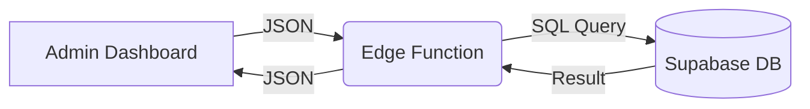

# Booking System Architecture - Complete Flow Documentation

> **Purpose**: This document explains the complete booking flow from start to finish. Use this as context when creating new functions or explaining the system to AI.

---

## System Overview

**Tech Stack**:
- **Frontend**: React + TypeScript (Vite)
- **Backend**: Supabase Edge Functions (Deno)
- **Database**: Supabase PostgreSQL (Local-First)

**Architecture Shift (2026-01)**: The system has migrated from a hybrid wrapper around Matchday to a **Standalone Booking System**.
- **Single Source of Truth**: Local Supabase Database (`bookings` table).
- **Matchday**: Deprecated/Removed. We no longer pull data from or sync to Matchday.

---

## Data Model (Supabase)

### 1. `bookings` Table (Core)
The primary table for all booking data.
```sql
CREATE TABLE bookings (
    booking_id BIGSERIAL PRIMARY KEY,
    field_no INTEGER NOT NULL,      -- Field ID (1-6)
    date DATE NOT NULL,             -- Booking Date
    time_from TIME NOT NULL,        -- Start Time
    time_to TIME NOT NULL,          -- End Time
    price_total_thb INTEGER,        -- Final Price
    customer_id TEXT,               -- Link to Profile (or null)
    display_name TEXT,              -- Customer Name
    phone_number TEXT,              -- Contact
    status TEXT DEFAULT 'confirmed',-- confirmed, cancelled
    is_promo BOOLEAN DEFAULT FALSE,
    admin_note TEXT,
    source TEXT DEFAULT 'admin',    -- matchday_import, admin, line
    paid_at TIMESTAMPTZ,
    created_at TIMESTAMPTZ DEFAULT NOW()
);
```

### 2. `profiles` Table
Stores customer information for quick booking.
```sql
CREATE TABLE profiles (
    user_id TEXT PRIMARY KEY,       -- LINE User ID
    team_name TEXT,
    phone_number TEXT
);
```

### 3. `promo_codes` Table
Stores discount codes and usage history.
```sql
CREATE TABLE promo_codes (
    code VARCHAR(6) UNIQUE NOT NULL,
    status VARCHAR(20) DEFAULT 'active',
    -- ... validity details
);
```

---

## LINE Bot Search Workflow

### Overview
The LINE Bot provides a simplified search interface focusing on **Time** and **Duration** rather than specific fields.

### Flow Steps
### Flow Steps
1.  **User Interaction**: User taps "จองสนาม" or "ค้นหาเวลา".
2.  **Profile Check (Onboarding)**:
    - System checks `profiles` table for `user_id`.
    - **If Missing**: Bot asks for **Team Name** and **Phone Number**.
    - **If Found**: Proceeds to next step.
3.  **Search All Fields**:
    - User selects **Date** (Today/Tomorrow/Custom).
    - User selects **Duration** (1hr, 1.5hr, 2hr).
    - System searches all fields and displays available slots in a Carousel.
4.  **Booking/Promo**:
    - User selects a time slot.
    - System generates a **Promo Code** for that slot.

---

## Service Logic: Search Strategy

### Strategy: 30-Minute Grid (Current Standard)
The system uses a **30-Minute Grid** strategy to find available slots.

- **Step Interval**: 30 minutes (08:00, 08:30, 09:00...)
- **Why**:
    - Catches "half-hour" slots (e.g., 14:30) that hourly searches miss.
    - Easier to implement and more predictable than "Gap Filling".
    - Maximizes revenue by finding 1.5h holes in the schedule.

### Algorithm
```typescript
// searchService.ts
const STEP = 30; // 30-minute intervals
for (let t = Open; t + Duration <= Close; t += STEP) {
    if (!isConflict(t, Duration)) slots.push(t);
}
```

---

## Complete Booking Flow (Step-by-Step)

### 1. User Initiates Booking
**Location**: Frontend UI (Admin Dashboard)
**Action**: User selects Court, Time, and enters details.
**API Call**: `POST /functions/v1/create-booking`

### 2. Edge Function Processing
**File**: `supabase/functions/create-booking/index.ts`

**Steps**:
1.  **Validate Input**: Check for required fields.
2.  **Calculate Price**:
    - Uses local `PRICING` config.
    - Applies Pre/Post 18:00 logic.
    - Rounds UP to nearest 100.
3.  **Conflict Check**: (Implicitly handled but should be explicit)
    - Though `create-booking` currently trusts the admin, best practice is to check overlaps.
4.  **Insert into Database**:
    - Direct `INSERT` into `bookings` table.
    - Sets `status: 'confirmed'`, `source: 'admin'`.
    - Generates numeric `booking_id` (timestamp-based) for compatibility.

### 3. Return Response for UI Update
Returns the created booking object immediately. No external API delays.

---

## Promo Code Booking Flow

### 1. Promo Code Generation (LINE Bot)
- User selects time slot -> System generates code in `promo_codes`.
- Calculates `final_price` based on discount rules.

### 2. Admin Uses Promo Code
**Location**: Admin Dashboard -> "ใช้โค้ด/Redeem Code"
**API Call**: `POST /functions/v1/validate-promo-code`
- **Validation**: Checks status (active), expiry, and **Real-Time Slot Availability** (as of 2026-01-29).

### 3. Create Booking with Discount
**File**: `supabase/functions/use-promo-code-and-book/index.ts`

**Steps**:
1.  **Re-Validate**: Checks code and availability again.
2.  **Create Booking (Local Insert)**:
    - Inserts into `bookings` with `is_promo: true`, `source: 'line'`.
    - Sets `price_total_thb` to the discounted `final_price`.
    - Adds `admin_note` with promo details (e.g., "Promo: XXXXXX | Discount: 50").
3.  **Update Promo Status**:
    - Marks code as `used` in `promo_codes`.
    - Links `booking_id`.
4.  **Send Notification**:
    - Sends LINE Push Message to user (if `user_id` exists).

### 4. Automatic Notification
System sends a standardized confirmation message via LINE:
- "✅ การจองสำเร็จ"
- Shows Field, Date, Time, Net Price.
- Includes cancellation contact info.

---

## Key Files Reference

### Backend Functions
| File | Purpose |
|------|---------|
| `create-booking/index.ts` | **Core**: Admin manual booking creation |
| `use-promo-code-and-book/index.ts` | **Core**: Promo code redemption & booking |
| `get-bookings/index.ts` | **Core**: Fetch daily schedule (Local DB) |
| `bookingService.ts` / `searchService.ts` | Shared logic for slot availability (Bot) |
| `validate-promo-code/index.ts` | Check code validity & slot status |

---

## Critical Concepts for AI Context

### 1. Price Calculation Logic
**Rule**: Split booking into pre-18:00 (Price A) and post-18:00 (Price B) segments.
**Rounding**: Round UP total price to nearest 100 THB.

### 2. Timezone Handling
- System operates in **Asia/Bangkok (UTC+7)**.
- All database queries for `date` should ensure correct timezone comparison.
- Time strings are usually passed as `HH:MM`.

---

## Version Control & Rollback

### Question: "Can I rollback if AI makes changes?"

**Answer**: Yes, using Git.

#### Step 1: Check Current Status
```bash
git status
```

#### Step 2: See What Changed
```bash
git diff
```

#### Step 3: Rollback Specific File
```bash
git checkout -- supabase/functions/create-booking/index.ts
```

#### Step 4: Rollback Everything
```bash
git reset --hard HEAD
```

---

## 6. Local Data Flow (Standalone)

**Purpose**: Direct interaction with the local Supabase database.

**Workflow**:

#### A. Reading Data (`get-bookings`)
1.  Frontend calls `get-bookings`.
2.  Edge function query `bookings` table directly.
3.  Filters by `date` and `status != 'cancelled'`.
4.  Returns array to frontend.

#### B. Writing Data (`create-booking` / `update-booking`)
1.  Frontend calls create/update endpoint.
2.  Edge function performs validation (conflicts, price).
3.  **Direct Insert/Update** to `bookings` table.
4.  No external API calls are made.

**Data Flow Diagram**:

    
    E[Admin Dashboard] -- View Schedule --> F(Edge Function: get-bookings)
    F -- 1. Fetch --> C
    F -- 2. Fetch Notes --> D
    F -- 3. Merge & Return --> E
```

---

## Admin Booking Management (Drag & Drop)

### Overview
The Admin Dashboard provides an interactive interface for managing bookings through drag-and-drop actions. This allows admins to:
1.  **Move Bookings**: Change time or court by dragging.
2.  **Resize Bookings**: Extend or shorten duration by dragging the edges.
3.  **Edit Details**: Click to edit price, name, or phone number.

### Drag & Drop Logic

**Component**: `BookingCard` within `DashboardPage`

1.  **Interaction**:
    - **Click**: Opens `BookingDetailModal`. (Threshold: < 5px movement)
    - **Drag**: Initiates move operation. (Threshold: > 5px movement)
    - **Resize**: Triggered by top/bottom handles.

2.  **Validation**:
    - **Collision Detection**: Prevents dragging onto existing bookings.
    - **Boundaries**: Constrained within opening hours (08:00 - 00:00).
    - **Snap to Grid**: 30-minute intervals.

3.  **Price Recalculation**:
    - Automatically recalculates price based on new time and duration (Pre/Post 18:00 rules).
    - Updates UI immediately (Ghost Element).

### Move Court Strategy (Backend)

**Edge Function**: `update-booking`

**Challenge**: Moving a booking to a different court requires changing the `courts` array in Matchday, which not all update endpoints support equally.

**Implementation**:
- **Direct Update**: The system sends a `PUT` request to Matchday with `court_id` and `courts: [id]`.
- **Payload**:
    ```typescript
    {
        time_start: "YYYY-MM-DD HH:mm:ss",
        time_end: "YYYY-MM-DD HH:mm:ss",
        court_id: 2426,       // Target Court ID
        courts: ["2426"],     // Target Court Array
        change_price: 1200,   // Recalculated Price
        price: 1200,          // Base Price Update
        description: "Name Phone" // Preserve details
    }
    ```
- **Result**: The Booking ID is **preserved**. The booking simply moves to the new lane.

### Data Synchronization

When a booking is modified:
1.  **Matchday**: Receives new time, court, and price. (Source of Truth for Schedule)
2.  **Local DB**: Receives update signal.
    - If `court_id` changes, Local DB metadata (notes, payment status) remains attached to the **Booking ID**.
    - `booking_id` is the stable key linking both systems.
